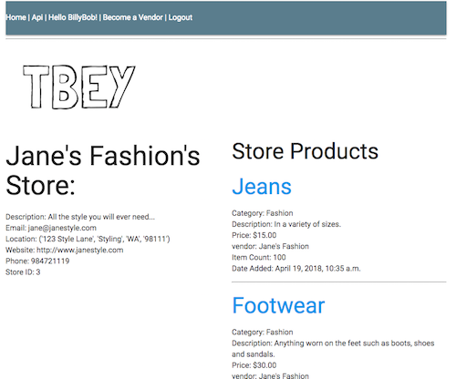
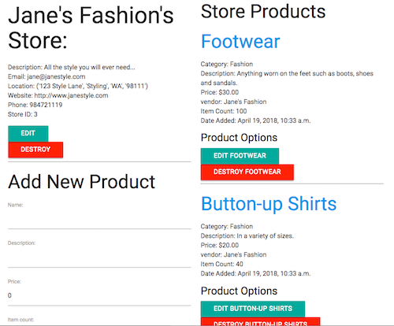
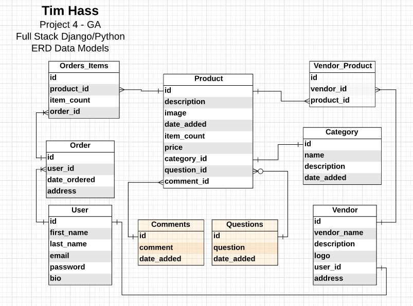
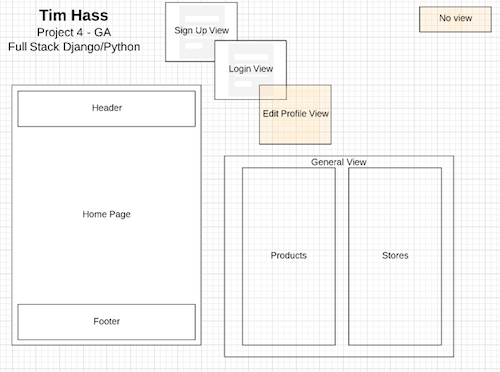
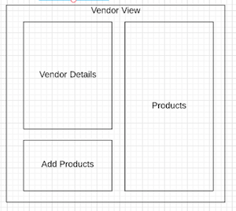
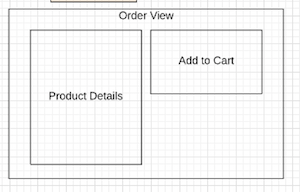
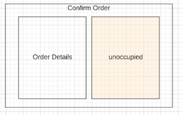

# TBEY

Project 4 - GA

## About
TBEY is a small and niche market online store.  With an account users can purchase items from other user stores.  Users can currently only create one store (see next steps).

### Hosted App
[TBEY Site](https://tbey.herokuapp.com/)

## Technology Used
HTML, CSS, Materialize, Django, Python, jQuery/Ajax, Postgresql

## User Stories
- Jane and Billy (small business owners) would like a platform to host products and services offered by their business.
- TBEY allows small businesses to track products and services purchased by users (see next steps).
- TBEY allows small businesses to interact with their clients asking them about upcoming products and services. (see next steps).
- Mel and Paul (customers) would like a unique platform to purchase products and services from.
- TBEY allows any user to create a store for selling products and services.

### Views
Customer View

Vendor View

### CRUD Routes
Verb | Path | Action | Used for
------------ | ------------- | ------------ | -------------
GET | re_path('^$'... | read | - returns index/home page
GET | <int:product_id>/ | read | - returns product pro
GET | user/<user_name>/ | read | - returns user profile
GET (POST) | login/ | read (post) | - login view or login user
GET | logout/ | read | - logs user out
POST | signup/ | post | - create new user account
POST | post_product/<int:vendor_id>/'| post | - creates a new product
POST | like_product/ | post | - records a new like for product
PUT | <int:product_id>/edit_product/ | update | - edit a product
DELETE | <int:product_id>/destroy/ | delete | - delete a product
GET | vendor/<int:vendor_id> | read | - view store profile
POST | vendor_signup/<int:user_id>/ | post | - store signup
PUT | <int:vendor_id>/edit_vendor/ | update | - edit vendor profile
DELETE | <int:vendor_id>/destroy_vendor/ | delete | - delete a vendor
GET | cart_detail/ | read | - view cart detail
POST (PUT) | re_path('^add/(?P<product_id>\d+)/$... | post (update) | - add item to cart
DELETE | re_path('^remove/(?P<product_id>\d+)/$... | delete | - remove items from cart
POST | re_path('^create/$... | post | - create the order (submit)

### Data Models

### Wireframes

## Development Process

Fri - Day 1  (½ half day)
- Created brainstorm document for start of wireframes and data models and user stories
- Review ideas, drafted some requirements, considered models and site structure
- Identified additional TODOs for boilerplate
- Implemented code for boilerplate template to handle log in and sign up errors

Saturday - Day 2
- Reviewed django tutorial and documentation
- Created repo and create local file structure from boilerplate for project 4
- Continued planning of ideas for project, decided on technologies,
- Began creating wireframes, data/model needs and app workflow.

Sunday - Day 3
- Creating data models and wireframes for views
- Began creating data models and initial built of base, index and vendor setup views
- Setup django admin panel, testing data models

Monday - Day 4
- Post Product and Post Vendor routes built
- Continued with refactoring of site layout to improve views
- Improved routes and did a little UI styling

Tuesday - Day 5
- Product and Vendor delete routes, logic for post product
- Order Product view built, additional updates to UI style

Wednesday - Day 6
- Order Post and Delete routes, inventory changes
- ISSUE with order post route, need to take into account edge cases for user orders
- Researched a solution for the edge case  
- readme started (oops..)

Thursday - Day 7
- Implemented required session, context_processor and cart needs for persistent order
- Put in place Post, Put and Delete routes for user orders
- readme updates

Friday - Day 8 - Presentation
- readme updates
- prepped for deployment
- hosted on Heroku

## Issues
- need to fix error handling on vendor route for attempts to add a second store.

## Next Steps - Unfinished Business
Things that were not completed or could be expanded upon within this app.

- Add more to readme...
- Edit route for user accounts
- Past Order summary for users
- Current Order summary for stores
- Add images for products, user and stores
- Issue with refresh reorder
- More styling of user interface for better user experience.
- Connect to Ebay/Costco api to query related products for purchase or price comparison (user and store)

### Routes not in place
Verb | Path | Action | Used for
------------ | ------------- | ------------ | -------------
GET | question/ | read | - QuestionIndexView Route for user store to ask customers product question
GET | question/<int:pk>/ | read | - QuestionDetailView see specific question details
GET | question/<int:pk>/results/ | read | - QuestionResultsView see question results
PUT | question/<int:pk>/vote/ | update | no view provided - logs customers to vote ex: /question/5/vote
POST | comment/<int:product_id>/ | post | - create a comment for a product
